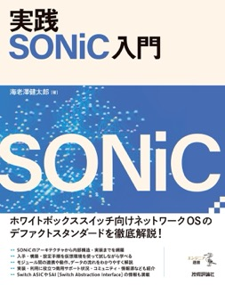

# 書籍 "エンジニア選書シリーズ 実践 SONiC入門"

ハンズオンを実施しやすいように、書籍に記載されたサンプルファイルを格納したレポジトリです。
紙版を購入いただいた方も、本レポジトリのファイルをダウンロード（コピー＆ペースト）してご利用ください。

* エラーや誤植等を見つけた際は、[本リポジトリの Issues](https://github.com/ebiken/sonic-book/issues) へ登録してください。
* 書籍内容に関するお問い合わせは、[技術評論社のお問合せフォーム](https://gihyo.jp/site/inquiry/book?ISBN=978-4-297-14943-7)からお願いします。

> ベストエフォートでの対応となりますので、返信が遅くなる場合や回答できない場合があります。

## レポジトリ構成

* `examples/`
  * 書籍で利用しているスクリプトや設定ファイルが保存されています。

## 書籍情報

[書籍の購入、書籍情報の詳細はこちらから：技術評論社 書籍サイト](https://gihyo.jp/book/2025/978-4-297-14943-7)

* エンジニア選書シリーズ "実践 SONiC入門"
* 2025年5月26日紙版発売
* 海老澤健太郎　著
* B5変形判／368ページ
* ISBN 978-4-297-14943-7

## 書籍刊行後のアップデート

アップデートがありましたら記載します。